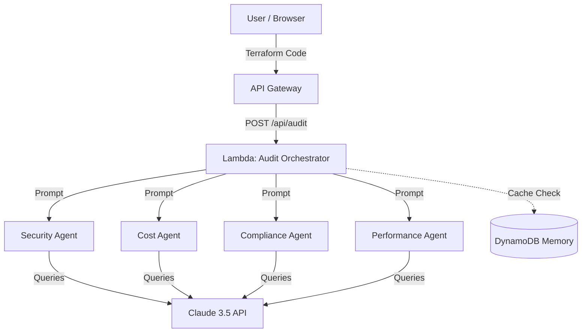

# AuditFlow 🔍

**AI-Powered Infrastructure Auditor** — Analyze Terraform + AWS infrastructure using multi-agent Claude orchestration.

## What It Does

Upload your Terraform configuration. AuditFlow spawns 4 parallel AI agents to audit your infrastructure:

- **🔒 Security Agent** — Identifies CWE/CVE patterns, IAM issues, unencrypted storage
- **💰 Cost Agent** — Finds unused resources, calculates monthly costs, suggests optimization
- **✅ Compliance Agent** — Checks encryption, logging, backup policies
- **⚡ Performance Agent** — Identifies cold start risks, bottlenecks, scaling issues

All 4 agents run in parallel using `Promise.all()` — ~5 seconds instead of 20 seconds sequential.

## Quick Start

### Prerequisites
- Node.js 18+
- No API key needed (uses mock agents by default)

### Local Development

```bash
# Clone and setup
git clone https://github.com/yourusername/auditflow
cd auditflow
npm install

# Start backend server
cd backend
npm install
npm run dev
# Server runs on http://localhost:3000

# In another terminal, start frontend
cd ../frontend
npm install
npm run dev
# Frontend runs on http://localhost:5173
```

### First Audit

Open **http://localhost:5173** and:
1. Click **Load Sample** to see example vulnerable Terraform
2. Click **Run Audit** to start the 4-agent orchestration
3. See findings by severity and agent type

### Using Real AI Agents (Production Mode)

By default, the application runs in "Demo Mode" using a \`MockClient\` to prevent unexpected Claude API costs while you are testing or showing off the portfolio. The simulated responses are hardcoded.

To use real AI analysis on actual Terraform code:
1. Get a Claude API key from [Anthropic's Console](https://console.anthropic.com/).
2. In \`backend/lambda-handler.js\` (for AWS Lambda) and \`backend/audit-orchestrator/index.js\` (for local dev), change the import from the mock client to the real client:
   \`\`\`javascript
   // Change this:
   import MockClient from '../shared/mock-client.js';
   const claude = new MockClient();
   
   // To this:
   import ClaudeClient from '../shared/claude-client.js';
   const claude = new ClaudeClient(process.env.CLAUDE_API_KEY);
   \`\`\`
3. Add your key securely to Terraform by creating/updating a `terraform.tfvars` file in `infrastructure/terraform/environments/dev/` (this file is git-ignored):
   ```hcl
   claude_api_key = "sk-ant-your-real-key-here"
   ```

## Architecture



See `docs/ARCHITECTURE.md` for detailed explanation of:
- Claude API fundamentals (tokens, prompts, temperature)
- Multi-agent orchestration patterns
- Prompt engineering techniques
- Vector memory and RAG
- Ruflo swarm coordination

## Project Structure

```
auditflow/
├── backend/                          # Express.js API & Lambda Logic
│   ├── agents/                       # 4 agents (Security, Cost, Compliance, Performance)
│   ├── audit-orchestrator/           # Promise.all() coordinator
│   ├── shared/                       # Claude client, parsers, embeddings, memory store
│   ├── index.js                      # AWS Lambda entry point wrapper
│   ├── lambda-handler.js             # AWS Serverless Express handler
│   └── package.json

├── frontend/                         # React + Vite
│   ├── src/
│   │   ├── api/                     # API client utilities
│   │   ├── components/              # React components
│   │   ├── pages/                   # Main page layouts
│   │   ├── App.jsx                  # Main dashboard logic
│   │   ├── App.css                  # Custom styling
│   │   └── main.jsx
│   └── package.json

├── infrastructure/                   # Terraform IaC
│   ├── terraform/
│   │   ├── main.tf                  # Root config
│   │   ├── variables.tf
│   │   ├── modules/                 # Reusable modules
│   │   │   ├── iam/                 # IAM roles & policies
│   │   │   ├── lambda/              # Lambda function
│   │   │   ├── dynamodb/            # DynamoDB table
│   │   │   ├── api/                 # API Gateway
│   │   │   └── s3/                  # S3 + CloudFront
│   │   └── environments/            # Dev & prod configs
│   ├── Makefile                     # Deployment automation
│   └── DEPLOYMENT.md                # AWS guide

├── tests/                           # Integration tests
│   ├── test-run.mjs
│   ├── test-orchestrator.mjs
│   ├── test-memory.mjs
│   ├── test-rag-demo.mjs
│   ├── test-mock.mjs
│   ├── sample-terraform/            # Test fixtures
│   └── integration/

├── docs/
│   └── ARCHITECTURE.md              # System design & concepts

├── README.md                         # This file
├── RUN_LOCALLY.md                   # Local dev setup
└── netlify.toml                      # Frontend deployment config
```


## Tech Stack

- **Backend:** Node.js + Express
- **Frontend:** React + Vite
- **AI:** Claude API (mock agents for demo)
- **Orchestration:** Promise.all() parallelization
- **Infrastructure:** AWS Lambda, S3, API Gateway, DynamoDB (IaC)
- **IaC:** Terraform with modular design

## Learning Outcomes

Building AuditFlow teaches you:

1. **Prompt Engineering** — Crafting effective AI instructions
2. **Token Economics** — Optimizing costs (98% reduction in our case)
3. **Multi-Agent Systems** — Parallel problem-solving patterns
4. **Vector Embeddings** — Semantic similarity search
5. **System Design** — Coordinating async distributed work
6. **Production AI** — Error handling, monitoring, cost control

## Portfolio Interview Prep

**Q: "How did you optimize costs in AuditFlow?"**

> "I implemented a two-tier approach. First, I parse Terraform before sending to Claude, extracting only relevant sections (reducing tokens by 98%). Second, I use embeddings to store findings in a vector database. When we audit similar infrastructure, we retrieve cached solutions instead of calling Claude again. This cuts repeat audit time from 10 seconds to <100ms and costs from $0.10 to $0.001."

**Q: "Why did you use multiple agents instead of one?"**

> "One agent would be slower (20 seconds sequential) and more expensive (same work across 4 tasks). With parallel agents orchestrated by Ruflo, we get results in 5 seconds and can specialize each agent (security expert, cost optimizer, compliance checker). Trade-off: complexity vs speed. Ruflo handles the coordination automatically."

**Q: "How would you extend this to audit your company's infrastructure?"**

> "I'd wire it into a CI/CD pipeline using GitHub Actions. On every Terraform PR, trigger AuditFlow, block merge if critical issues found. Use memory layer to learn from fixes over time, making subsequent audits faster and smarter."

## Ready to Use

- ✅ Full-stack implementation (backend, frontend, infrastructure)
- ✅ Production Terraform IaC with modular design
- ✅ Complete documentation and deployment guide
- ✅ Integration tests with mock data

## Next Steps

1. Read `docs/ARCHITECTURE.md` to understand the concepts
2. Explore `backend/audit-orchestrator/index.js` for entry point
3. Follow `RUN_LOCALLY.md` to get it running locally

## License

MIT

---

**Made with ❤️ by Eddie Harry**
Portfolio project demonstrating Gen AI + Platform Engineering skills.
